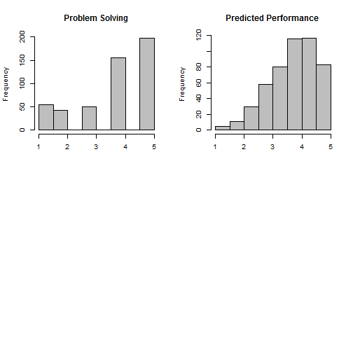

## We Understand Your World

1. Do you feel your employees are a cut above?
2. Do you desire to identify new hires that enhance current employee performance levels? 
3. Do you struggle to predict from interview the level of future performance?
4. Have you hired candidates, spent time grooming and training, only to be disappointed with their inability to excel in your workplace?
5. If a tool existed that could predict candidate performance, would you be interested?

--- .class #id 

## How Do We Start?

1. You identify characteristics that describe your high performing work force
2. Together we gather data for each characteristic and each employee
3. You provide the performance data for each employee
4. Our skilled team then generates a model that predicts employee performance with high confidence from selected characteristics
5. This model is plugged into our tool for your own custom use

--- .class #id 

## Sneak Peak Demonstration

1. We identified Communication, Problem Solving, and Personal Integrity as key characteristics defining our work force
2. Distributions for each are randomly generated skewing to high results to reflect our amazing personnel 
3. Our employee performance distribution demonstrates the linear relationship to the individual characteristics
4. We now have a model that can be used for all interviewees to predict future performance


--- .class #id 

## Look Under the Covers


```r
buildDist <- function() {
  pcomm <<- sample(1:5,500,TRUE,c(.1,.1,.2,.3,.3))
  pprob <<- sample(1:5,500,TRUE,c(.1,.1,.1,.3,.4))
  pntgrty <<- sample(1:5,500,TRUE,c(.1,.1,.1,.3,.4))
  port <- .2*pcomm + .3*pprob + .5*pntgrty
}

op <- par(mfrow = c(2,2))
hist(pprob,main="Problem Solving",xlab="",col="Gray")
hist(fitted(fit),main="Predicted Performance",xlab="",col="Gray")
par(op)
```

 

--- .class #id 

## Are You Ready to Take the Next Step?

1. Try our tool online https://beckyp.shinyapps.io/HiringTool  
2. Start thinking about your employee key characteristics
3. We are waiting for your call
